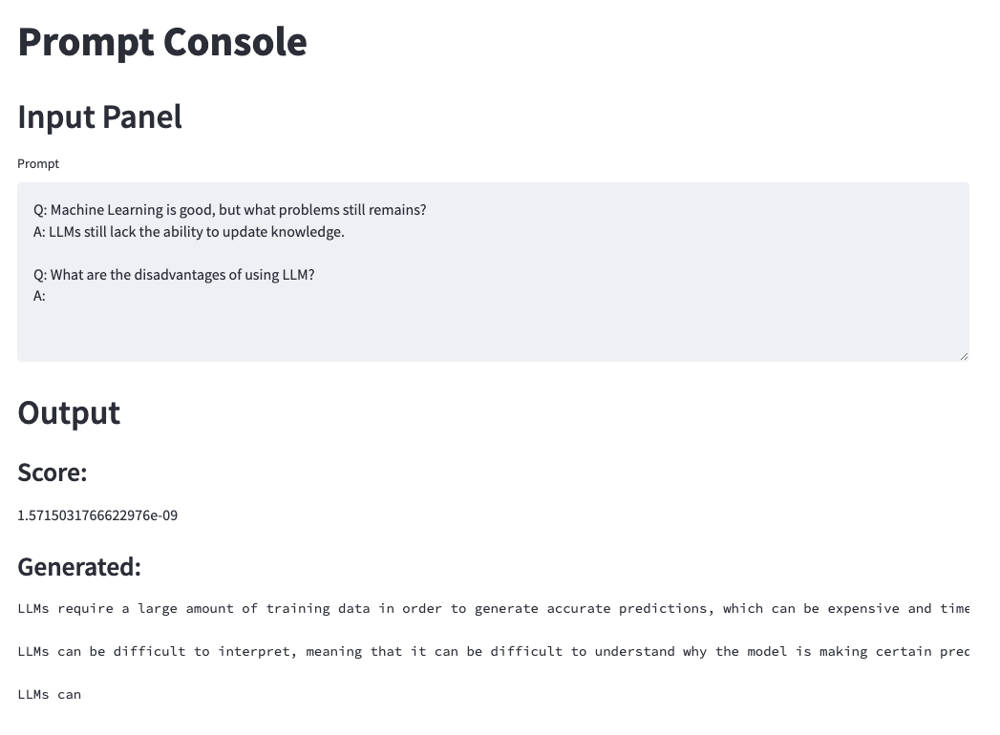

# 第二次技术培训

大家好，之前振方已经分享过Docker的部署应用。考虑到大家都具有一定的Conda环境管理的经验，我们第二次技术培训主要聚焦于如何快速的把已有的工作做成demo方便汇报（本次不会介绍工业级的前端），基于此目前我们计划花半个小时至一个小时的时间给大家简单的介绍下

## 快速前端Streamlit

Streamlit是一个快速前端，其特点是可以在Python端直接调用函数来在前端构造`Widget`(可以理解为前端的一个Object)和构造Widget并返回。其最方便的地方在于，其交互过程可以近似的视为一个流的过程因此当靠前的输入改变时，后面的输出会跟着改变（这一点很类似于以`React`为代表的一系列兼具效率与代码简洁性的前端方案）。其耦合了前后端，降低了初学者开发的难度（当然这也代表着牺牲了一定的定制化）。同时其仍然具有缓存机制，因此在调用一个本地模型的时候，可以不必每一次inference都重复加载模型。这些使得Streamlit非常适合机器学习工作者用来快速搭建Demo。

1. ### 基本的输入输出

2. 一个基本的Streamlit输入输出可以参考如下的形式

3. ```python
   # streamlit_io.py
   # 引入Streamlit包
   import streamlit as st
   # 获取输入文本
   text = st.text_input("Input Something")
   # 输出文本
   st.text(text)
   ```

4. 之后运行

5. ```bash
   streamlit run streamlit_io.py
   ```

6. 即可看到前端

7. 

8. ### 一个简单的Demo

9. ```python
   # streamlit_demo.py
   import streamlit as st
   
   # mask_filling_llm 是我实现的一个输入Prompt返回分数和生成文本的函数
   from api.LLM import mask_filling_llm
   # markdown方法会把输入的文本当做Markdown进行渲染并展示到前端上
   st.markdown("# Prompt Console")
   st.markdown("## Input Panel")
   # 使用text_area进行多行输入
   input = st.text_area("Prompt")
   # 判断是否空文本
   if input:
     # 调用方法
   	generated = mask_filling_llm(input)
   	st.markdown("## Output")
     # 展示调用方法返回的信息
   	st.markdown(f"### Score:\n{generated['logit'][0]}")
   	st.markdown(f"### Generated:")
   	st.text(generated['output'][0])
   ```

10. 将这个前端启动，并实现`mask_filling_llm`即可得到

11. 

## 后端快速搭建

1. 1. 简单Json格式介绍
   2. Flask快速Get/Post请求封装
   3. （可能会有）FastAPI的模块化管理

## 日志与数据管理（Mongo，pymongo；日常数据管理还有ES与Redis，不过我们不再进行展开了，需要时再学即可）

1. 1. 读、写的基本调用
   2. 数据更新与Upsert
   3. 索引简介（方便起见，直接使用Compass、可以使用其他工具）

## Git的使用

1. 1. GitLab项目与群组的创建和人员增减（以公司的为例）
   2. Access Token的创建与Git Clone
   3. Git add commit push pull的基本使用
   4. Git branch 和 checkout、merge（简单的分支管理）
   5. Issue的创建与commit时如何引用
   6. Submodule简单介绍，与submodule-for的简单示例
   7. 自动部署的简单介绍（日常科研不一定用得到，简单介绍下概念）

## Nginx简介（方便部署正式的工业级前端，与请求转发；Nginx只做简单介绍方便大家了解一个正式的前后端分离工程的部署）

1. 1. 什么是Nginx
   2. 简单的负载均衡
   3. 请求转发

## Bert 经典分类器训练

Note: 除了Demo之外，虽然现在超大模型的影响力与日俱增，但BERT等模型的使用还是很多的。因此我还会顺带过一下经典的Bert分类器训练（使用transformers库的trainer）

